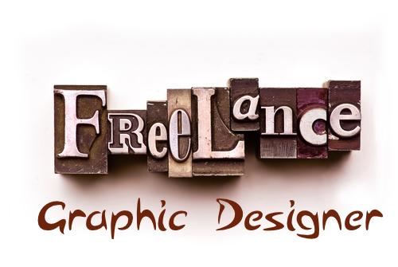
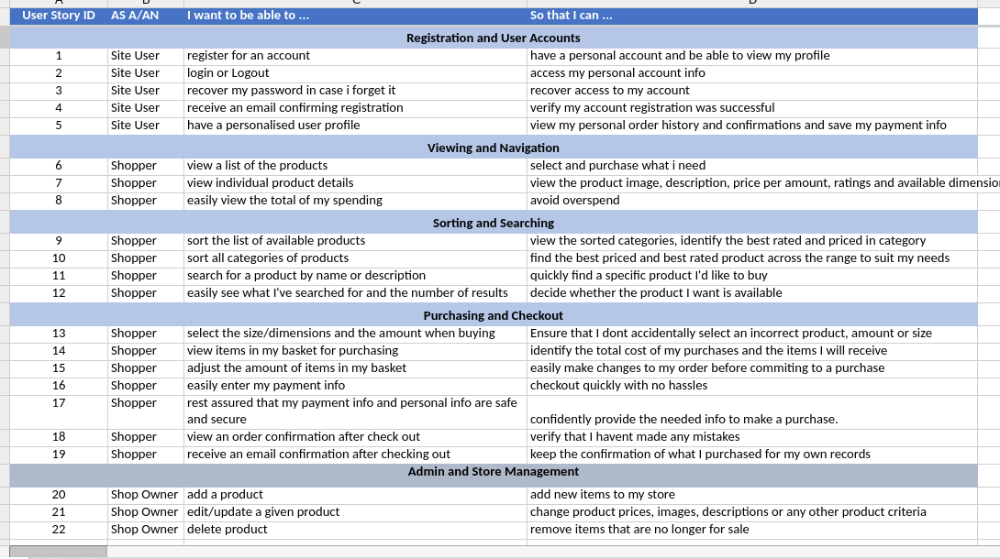

# Freelance Graphix Designer

* Milestone Project #4

#

# Contents

+ <a href="#context">Context</a>
+ <a href="#ux">UX</a>
  + <a href="#summary">Summary</a>
  + <a href="#design">Design</a>
  + <a href="#user">User Stories / Goals</a>
  + <a href="#dev">Developer's / Goals</a>
  + <a href="#wire">Wireframes</a>
+ <a href="#feats">Features</a>
  + <a href="#present">At present</a>
  + <a href="#future">In future</a>
+ <a href="#tech">Technologies used</a>
+ <a href="#tests">Testing</a>
  + <a href="#auto"> Automated</a>
  + <a href="#man">Manual</a>
  + <a href="#res">Responsiveness</a>
  + <a href="bugs">Bugs</a>
+ <a href="#deploy">Deployment</a>
+ <a href="#cred">Credits</a>

# Context
This project is based around a graphics designer putting their services online to anyone who wants graphical work produced at a good competitive price.

# UX

## The Strategy

+ This website will be serving the needs of the design community with quick and easy access via the website to their proposed solution.

+ The main reason for this site is for the owner to not only make an income from putting their skills and services online but also so that designers (albeit web designers/developers) searching for someone to do a particular graphical task, for example design a business card or a website logo. 

  Both those needs are fulfilled by the creation of this website to bridge that gap.

## The Scope

+ The key functionality here would be to design and deliver to the customer what that customer/designer needs. For example they want to spread the word of their new business and what it can offer so they need a digital design to be used on a business card that fits this purpose.
  
  + A user should come to the site and walk away happy with their graphic(s) files for immediate use in their business/project.

  + The site could also offer logo designs, web banners, icon sets and even posters designs and brochure/flyer designs too.

## The Structure

+ If I was a user to this site (and after looking around and being pleased with what I see) I'd look for the link/button/clickable element to follow so I could basically place my order.
+ I'd expect to be asked for 
  + my contact details, name, email adress, phone number via an information gathering form.
  + what type of graphic I'm looking for (logo, icon set, business card, etc..)
  + the particular size
  + a brief explanation as to what is the content of this design that I'm looking for.
  + a follow-up preferable contact (email or phone only) from the site owner/graphic designer to accrue more information to the request after payment 
  + to pay for my design via payment screens.

## The Skeleton

+ 

## The surface

## Summary

+ This website has been designed with what the shop owner/designer can do for their online customers by  catering for their design needs whether it be digital or in print. The customer should be able to successfully purchase the product they need and the shop owner will have full administrative permissions to add, delete and update their products online.

## Design
+ Colours Used
  
  I opted to stay with a good contrastal pair of colours (black & white) because of the visual impact it has. Also the extra colours from the products lend themselves to the browsing experience.

+ Typography

  The 'Lato' font from Google was used extensively for continuity and for its crisp and clear appearance throughout.

## User Stories / Goals

+ All User Stories are located below

## Developers' Goals

+ It has been my goal as the developer of this website to provide the ability for a graphics designer who has a marketable product to sell it online via the use of up-to-date modern digital technologies.

## Wireframes

# Features

+ This site features the ability to discern off the bat, what types of graphical design the designer is offering to the user. Namely, print media or digital media.

## At present

+ Print Media...

  + Business Cards

  + Leaflets and Flyers

  + Posters

+ Digital Media...

  + Icon Sets

  + Brand/Logo Design

  + Web Banners/Ads

Each media category has their own unique size to choose from

For example the size choices of Icon Sets in Digital Media range from 16 x 16 pixels to 256 x 256 pixels.

## In the future

+ For features in future upgrades of the site, I'd like to implement better communication with the prospective client (the customer) in that they can bring forward their ideas and the designer would 'hash out' a meaning design to suit with a limited number of revisions per design.

# Technologies Used

## Front-End

  + Html - Is a mark-up language used to structure the main frontend of the site - it helps to 'layout' what you see in the finished product.

  + CSS - Used to add certain 'styles' to your Html mark-up to make them look better

  + Java-Script - was used to add functionality and versatility to the design of the site.

  + jQuery - was used to manipulate the DOM easier than javascript

  + Bootstrap - used to aid the look and feel of certain pages within the site and also to help with responsiveness of the site in various devices.

## Back-End

  + [Python Programming Language](https://www.python.org/)

    - Python is a programming language that lets you work more quickly and integrate your systems more effectively.

  + [Django](https://www.djangoproject.com/)

    - Django is a high-level Python Web framework that encourages rapid development and clean, pragmatic design. Built by experienced developers, it takes care of much of the hassle of Web development, so you can focus on writing your app without needing to reinvent the wheel. It’s free and open source.

  + [Django-Allauth](https://django-allauth.readthedocs.io/en/latest/)

    - Integrated set of Django applications addressing authentication, registration, account management as well as 3rd party (social) account authentication.

  + [Stripe](http://www.stripe.com)

    - Stripe offers payment processing software and application programming interfaces for e-commerce websites and mobile applications

  + [Django-Crispy Forms](https://django-crispy-forms.readthedocs.io/en/latest/)

    - Django-crispy-forms provides you with tags that will let you control the rendering behavior of your Django forms in a very elegant and DRY way.

  + [Amazon Web Services AWS S3](https://aws.amazon.com/)

    - Amazon Simple Storage Service (Amazon S3) is storage for the Internet. It is designed to make web-scale computing easier. Amazon S3 has a simple web services interface that you can use to store and retrieve any amount of data, at any time, from anywhere on the web.

  + [Pillow](https://pypi.org/project/Pillow/)

    - The Python Imaging Library (Pillow) adds image processing capabilities to your Python interpreter.

  + [Jinja](https://jinja.palletsprojects.com/en/3.0.x/)

    - Jinja is a fast, expressive, extensible templating engine. Special placeholders in the template allow writing code similar to Python syntax. Then the template is passed data to render the final document.

  + [Boto3](https://boto3.amazonaws.com/v1/documentation/api/latest/index.html)

    - You use the AWS SDK for Python (Boto3) to create, configure, and manage AWS services, such as Amazon Elastic Compute Cloud (Amazon EC2) and Amazon Simple Storage Service (Amazon S3). The SDK provides an object-oriented API as well as low-level access to AWS services.

  + [Gunicorn](https://gunicorn.org/)

    - Gunicorn 'Green Unicorn' is a Python WSGI HTTP Server for UNIX. It's a pre-fork worker model. The Gunicorn server is broadly compatible with various web frameworks, simply implemented, light on server resources, and fairly speedy.

  + [Psycopg2](https://pypi.org/project/psycopg2/)

    - Psycopg is the most popular PostgreSQL database adapter for the Python programming language.

# Testing

## Automated

  - Validators

HTML Validated

CSS Validated

The validaor picked up 2 errors only from Bootstrap tho.

PEP8 Compliancy

Due to time restrictions this section needs reviewing later

## Manual

## Responsiveness

## Bugs

# Deployment

[Freelance-Graphix-Designer](https://freelance-graphix-designer.herokuapp.com/)

Site deployed to Heroku and all images and static files uploaded to Amazon Web Services (AWS) namely their 's3' service where you can store a miniumum amount of files for free.

# Credits

Images used in the creation of this site for its content were accrued from [Fiver](www.fiver.com) and some from [Unsplash](www.unsplash.com)

Code - The project code was built upon 'Boutique_Ado' mini project from Code Institute. 
The videos in the LMS in C.I. helped and guided me alot in the creation of my project. I really couldn't have done it in the time I had if I had not used these as strong support.

Thanks to ...

  - Mentor: Akshat Garg for his help and guidance on this project at the beginning and also 2BN-Chris_mentor for his guidance on what to focus on to get the project submitted - thanks guys! 

  - My Family for being there and being a sounding board!

  - Slack Channel for answering questions that were bugging me.

  - Tutor Support for pointing me in the right direction with gentle nudges along the way. A million thankyous to Jo - Shirley - Scott - & Igor. You guys are amazing!